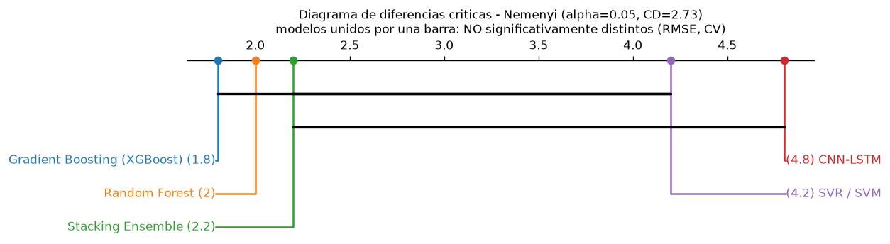

# Pruebas estadisticas - comparacion formal de los 5 modelos base

Datos: `ml_model_metrics`, `fold` 0-4 (5 folds de la validacion cruzada temporal),
version 1.0 (modelos SIN tuning). Metrica de error: `rmse` de las filas de
regresion (media de RMSE de NEE y FCH4). alpha = 0.05.

RMSE medio entre folds (menor = mejor): Random Forest 21.54, Gradient Boosting (XGBoost) 22.16, Stacking Ensemble 22.35, SVR / SVM 30.69, CNN-LSTM 31.93
F1_macro medio entre folds (mayor = mejor): Stacking Ensemble 0.722, CNN-LSTM 0.705, Gradient Boosting (XGBoost) 0.691, SVR / SVM 0.664, Random Forest 0.632

> El **mejor por criterio combinado** (Paso 5) es **Stacking Ensemble** (mejor F1_macro,
> AUC y estabilidad entre folds). Por **RMSE puro** de la CV el mas bajo es
> **Random Forest** (no es Stacking Ensemble): la diferencia de RMSE entre ambos es pequena, ver pruebas pareadas mas abajo.
> La referencia de estas pruebas es **Stacking Ensemble** y el 2o mejor **Random Forest**.

## 1. Normalidad (Shapiro-Wilk)

### Error RMSE (CV)
| objeto | n | shapiro_W | p_value | normal_alpha05 |
| --- | --- | --- | --- | --- |
| RMSE: Stacking Ensemble | 5 | 0.8087 | 0.09518 | SI |
| RMSE: Random Forest | 5 | 0.7685 | 0.0438 | no |
| RMSE: Gradient Boosting (XGBoost) | 5 | 0.8166 | 0.1098 | SI |
| RMSE: SVR / SVM | 5 | 0.937 | 0.6446 | SI |
| RMSE: CNN-LSTM | 5 | 0.8813 | 0.3151 | SI |
| RMSE: dif Stacking Ensemble-Random Forest | 5 | 0.9742 | 0.9013 | SI |
| RMSE: dif Stacking Ensemble-Gradient Boosting (XGBoost) | 5 | 0.9538 | 0.7641 | SI |
| RMSE: dif Stacking Ensemble-SVR / SVM | 5 | 0.9673 | 0.8574 | SI |
| RMSE: dif Stacking Ensemble-CNN-LSTM | 5 | 0.9591 | 0.802 | SI |

**Decision:** al menos una distribucion/diferencia NO pasa Shapiro (p <= alpha) -> se usan pruebas NO PARAMETRICAS.

### F1_macro (CV)
| objeto | n | shapiro_W | p_value | normal_alpha05 |
| --- | --- | --- | --- | --- |
| F1: Stacking Ensemble | 5 | 0.7941 | 0.07253 | SI |
| F1: Random Forest | 5 | 0.897 | 0.3938 | SI |
| F1: Gradient Boosting (XGBoost) | 5 | 0.9517 | 0.7492 | SI |
| F1: SVR / SVM | 5 | 0.8226 | 0.1223 | SI |
| F1: CNN-LSTM | 5 | 0.9032 | 0.4276 | SI |
| F1: dif Stacking Ensemble-Random Forest | 5 | 0.7113 | 0.01253 | no |
| F1: dif Stacking Ensemble-Gradient Boosting (XGBoost) | 5 | 0.9102 | 0.4689 | SI |
| F1: dif Stacking Ensemble-SVR / SVM | 5 | 0.8577 | 0.2199 | SI |
| F1: dif Stacking Ensemble-CNN-LSTM | 5 | 0.9552 | 0.7745 | SI |

**Decision (F1):** no parametricas.

> **Aviso de potencia (n = 5 folds):** Shapiro-Wilk casi no tiene potencia para
> detectar no-normalidad con 5 datos, y la prueba de Wilcoxon con 5 pares no
> puede bajar de p ≈ 0.0625 (nunca alcanza significancia a 0.05). Los resultados
> son **indicativos**, no concluyentes; se reportan ambas familias de pruebas.

## 2. Comparacion pareada: Stacking Ensemble vs cada modelo (Holm)

### Error RMSE (CV)
| comparacion | metrica | test | statistic | p_value | mean_diff | p_holm | significativo_alpha05 |
| --- | --- | --- | --- | --- | --- | --- | --- |
| Stacking Ensemble vs Random Forest | RMSE (CV) | Wilcoxon signed-rank | 4 | 0.4375 | 0.8072 | 0.875 | no |
| Stacking Ensemble vs Gradient Boosting (XGBoost) | RMSE (CV) | Wilcoxon signed-rank | 7 | 1 | 0.1857 | 1 | no |
| Stacking Ensemble vs SVR / SVM | RMSE (CV) | Wilcoxon signed-rank | 0 | 0.0625 | -8.34 | 0.25 | no |
| Stacking Ensemble vs CNN-LSTM | RMSE (CV) | Wilcoxon signed-rank | 0 | 0.0625 | -9.58 | 0.25 | no |

### F1_macro (CV)
| comparacion | metrica | test | statistic | p_value | mean_diff | p_holm | significativo_alpha05 |
| --- | --- | --- | --- | --- | --- | --- | --- |
| Stacking Ensemble vs Random Forest | F1_macro (CV) | Wilcoxon signed-rank | 3 | 0.3125 | 0.09024 | 0.9375 | no |
| Stacking Ensemble vs Gradient Boosting (XGBoost) | F1_macro (CV) | Wilcoxon signed-rank | 4 | 0.4375 | 0.03101 | 0.9375 | no |
| Stacking Ensemble vs SVR / SVM | F1_macro (CV) | Wilcoxon signed-rank | 1 | 0.125 | 0.05815 | 0.5 | no |
| Stacking Ensemble vs CNN-LSTM | F1_macro (CV) | Wilcoxon signed-rank | 7 | 1 | 0.01737 | 1 | no |

## 3. Comparacion global de los 5 modelos

### Error RMSE (CV)
| prueba | metrica | statistic | p_value | significativo_alpha05 |
| --- | --- | --- | --- | --- |
| Kruskal-Wallis | RMSE (CV) | 5.236 | 0.264 | no |
| Friedman (medidas repetidas) | RMSE (CV) | 15.52 | 0.003736 | SI |

### F1_macro (CV)
| prueba | metrica | statistic | p_value | significativo_alpha05 |
| --- | --- | --- | --- | --- |
| Kruskal-Wallis | F1_macro (CV) | 1.265 | 0.8673 | no |
| Friedman (medidas repetidas) | F1_macro (CV) | 5.051 | 0.2822 | no |

## 4. Diebold-Mariano: Stacking Ensemble vs Random Forest (holdout 2018, 365 dias)

Sobre la secuencia de errores diarios del holdout (marco natural de la prueba;
las otras pruebas usan los 5 folds de la CV). Perdida = error cuadratico.
`mean_loss_diff < 0` -> Stacking Ensemble predice mejor.

| serie | DM_stat | p_value | mean_loss_diff | lag_NW | n | significativo_alpha05 |
| --- | --- | --- | --- | --- | --- | --- |
| error NEE | -0.3133 | 0.7542 | -0.01934 | 7 | 365 | no |
| error FCH4 | -1.49 | 0.1372 | -71.96 | 7 | 365 | no |

## 5. Post-hoc de Nemenyi (tras Friedman significativo)

Friedman detecto diferencias globales en RMSE (p = 0.00374 < 0.05),
asi que se aplica el post-hoc de **Nemenyi** sobre la misma matriz RMSE
(folds x modelos). Libreria: scikit-posthocs. Diferencia critica **CD = 2.728** rangos.

**Rangos medios** (1 = mejor RMSE): Gradient Boosting (XGBoost) 1.80, Random Forest 2.00, Stacking Ensemble 2.20, SVR / SVM 4.20, CNN-LSTM 4.80

**Matriz de p-values pareados (Nemenyi):**

| modelo | Stacking Ensemble | Random Forest | Gradient Boosting (XGBoost) | SVR / SVM | CNN-LSTM |
| --- | --- | --- | --- | --- | --- |
| Stacking Ensemble | 1 | 0.9996 | 0.9946 | 0.2659 | 0.0703 |
| Random Forest | 0.9996 | 1 | 0.9996 | 0.1796 | 0.0409 |
| Gradient Boosting (XGBoost) | 0.9946 | 0.9996 | 1 | 0.1152 | 0.0227 |
| SVR / SVM | 0.2659 | 0.1796 | 0.1152 | 1 | 0.9751 |
| CNN-LSTM | 0.0703 | 0.0409 | 0.0227 | 0.9751 | 1 |

*(heatmap: `figuras/statistical_tests_nemenyi_pmatrix.png`)*

**¿Que par(es) explican la diferencia global?** El post-hoc **SI aisla** el/los par(es) responsable(s) de la diferencia global de Friedman: **Random Forest vs CNN-LSTM** (p = 0.041); **Gradient Boosting (XGBoost) vs CNN-LSTM** (p = 0.023). Es decir, la diferencia global la produce sobre todo **CNN-LSTM** (el peor por rango medio), que queda por debajo de los modelos de arboles. Entre **Stacking Ensemble**, **Random Forest** y **Gradient Boosting (XGBoost)** NO hay ninguna diferencia significativa (p ~ 1.0): son estadisticamente equivalentes en RMSE. **SVR / SVM** tiene el 2o peor rango pero su diferencia con los tres mejores NO alcanza significancia (p_min = 0.115); con solo 5 folds el post-hoc no tiene potencia para confirmarla.

## Interpretacion en texto simple (para el informe)

- **¿Normalidad?** Los errores por fold NO se ajustan a una normal, asi que se aplican Wilcoxon y Kruskal-Wallis / Friedman.

- **¿Stacking Ensemble es mejor que los demas de forma significativa (RMSE, CV)?**
  NO. Ninguna comparacion pareada alcanza p < 0.05 tras la correccion de Holm.
   Con 5 folds la prueba no tiene resolucion suficiente; la ventaja del Stacking se sostiene por su MENOR VARIABILIDAD entre folds y por el criterio combinado (F1_macro + AUC), no por una diferencia de RMSE estadisticamente demostrable.

- **¿Los 5 modelos son equivalentes en conjunto?** La prueba global da
  p = 0.264 (no se puede rechazar que todos rindan igual).
  Friedman (medidas repetidas) da p = 0.00374
  (diferencias significativas entre modelos).

- **Post-hoc de Nemenyi (¿que par explica la diferencia de Friedman?):** El post-hoc **SI aisla** el/los par(es) responsable(s) de la diferencia global de Friedman: **Random Forest vs CNN-LSTM** (p = 0.041); **Gradient Boosting (XGBoost) vs CNN-LSTM** (p = 0.023). Es decir, la diferencia global la produce sobre todo **CNN-LSTM** (el peor por rango medio), que queda por debajo de los modelos de arboles. Entre **Stacking Ensemble**, **Random Forest** y **Gradient Boosting (XGBoost)** NO hay ninguna diferencia significativa (p ~ 1.0): son estadisticamente equivalentes en RMSE. **SVR / SVM** tiene el 2o peor rango pero su diferencia con los tres mejores NO alcanza significancia (p_min = 0.115); con solo 5 folds el post-hoc no tiene potencia para confirmarla.

- **Diebold-Mariano Stacking Ensemble vs Random Forest:**
  error de NEE -> p = 0.754 (sin diferencia significativa);
  error de CH4 -> p = 0.137 (sin diferencia significativa).
  El signo de mean_loss_diff indica cual predice mejor.

- **Conclusion para el informe:** con la evidencia disponible (5 folds de CV +
  holdout 2018), no se puede afirmar que Stacking Ensemble sea estadisticamente superior en RMSE a Random Forest: las diferencias de exactitud son pequenas y el numero de folds es bajo. Stacking Ensemble se elige por su mejor comportamiento CONJUNTO (regresion + clasificacion), su menor varianza entre folds y el criterio combinado del Paso 5, no por una diferencia de error puntual demostrable.

---

## Nota metodologica (importante)

Estas pruebas se realizaron sobre los **5 modelos BASE** de la validacion
cruzada (`ml_model_metrics`, `fold` 0-4, version 1.0), **sin ajuste de
hiperparametros**.

El **modelo desplegado** es `Stacking Ensemble (tuned)` (`modelo_final.pkl`,
`ml_models` version `1.1-tuned`, `is_active = true`), un **refinamiento
posterior** del ganador ya seleccionado por el criterio combinado del Paso 5. El
tuning solo optimizo el meta-modelo del stacking (`Ridge(alpha=10)` en lugar de
`LinearRegression`) y algun hiperparametro de los modelos base; **no cambio la
eleccion de arquitectura**. La comparacion estadistica de esta seccion respalda
esa eleccion sobre las versiones base; el tuned es una mejora incremental sobre
el mismo modelo, no un candidato nuevo que debiera re-someterse a esta bateria.

*(generado por `python -m ml.training.statistical_tests` el 2026-09-01)*
